# ProofSkill Platform Workflows: Backend ↔ Frontend Integration

## 🎯 **Platform Overview**

ProofSkill is a comprehensive recruitment platform with two main user types:

- **👤 Candidates**: Job seekers looking for opportunities
- **🏢 Businesses**: Recruiters and companies hiring talent

---

## 👤 **CANDIDATE WORKFLOW**

### 📝 **1. Registration & Onboarding**

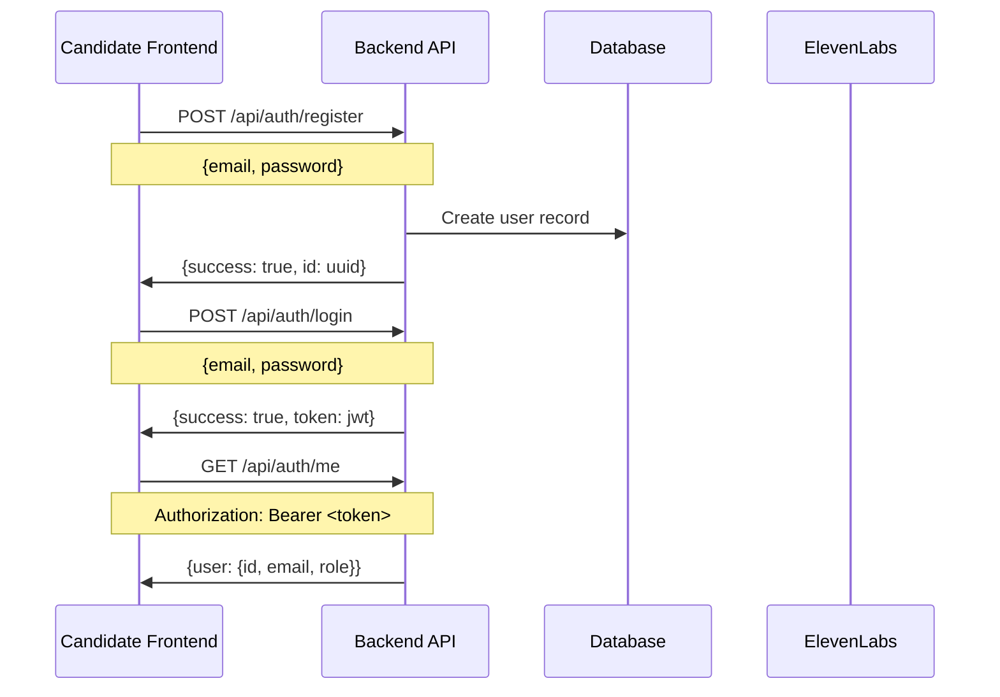

### 📄 **2. CV Upload & Processing**

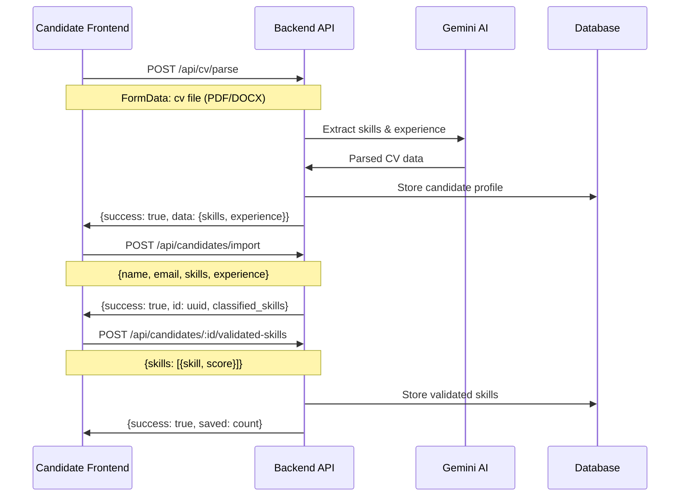

### 🎤 **3. Interview Process**

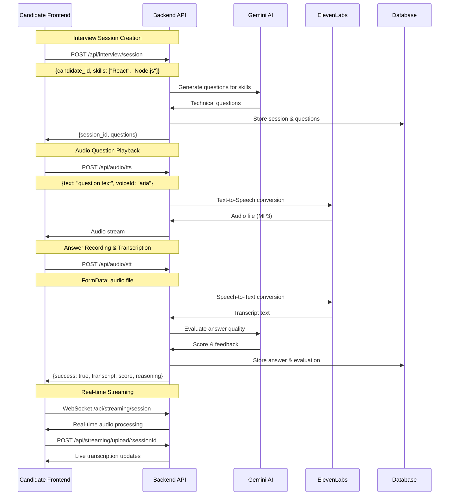

### 📊 **4. Results & Matching**

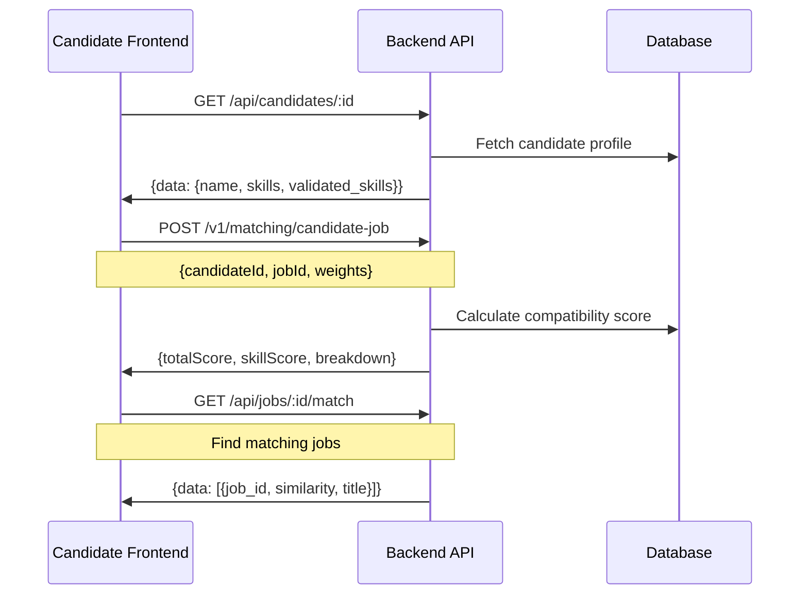

---

## 🏢 **BUSINESS WORKFLOW**

### 👨‍💼 **1. Recruiter Registration & Setup**

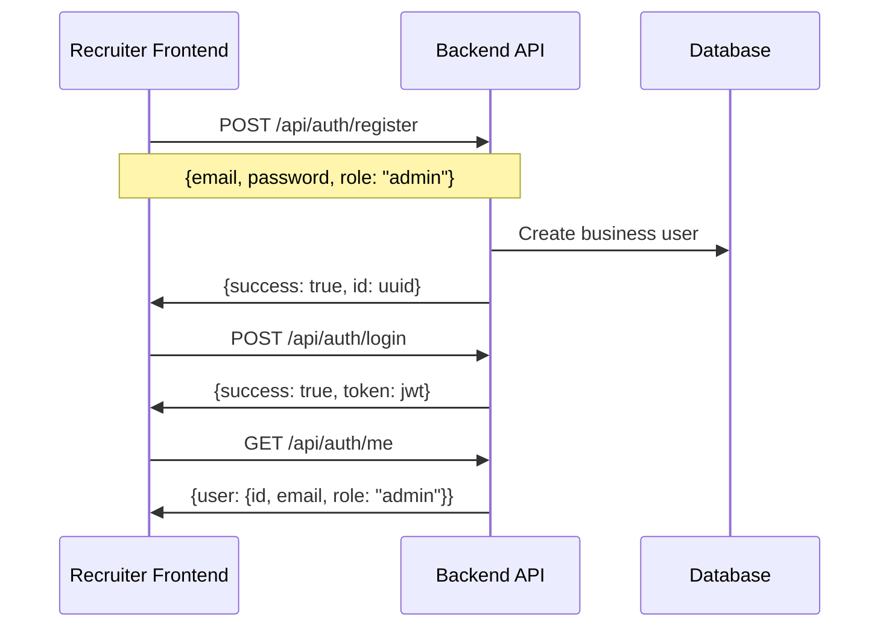

### 💼 **2. Job Management**

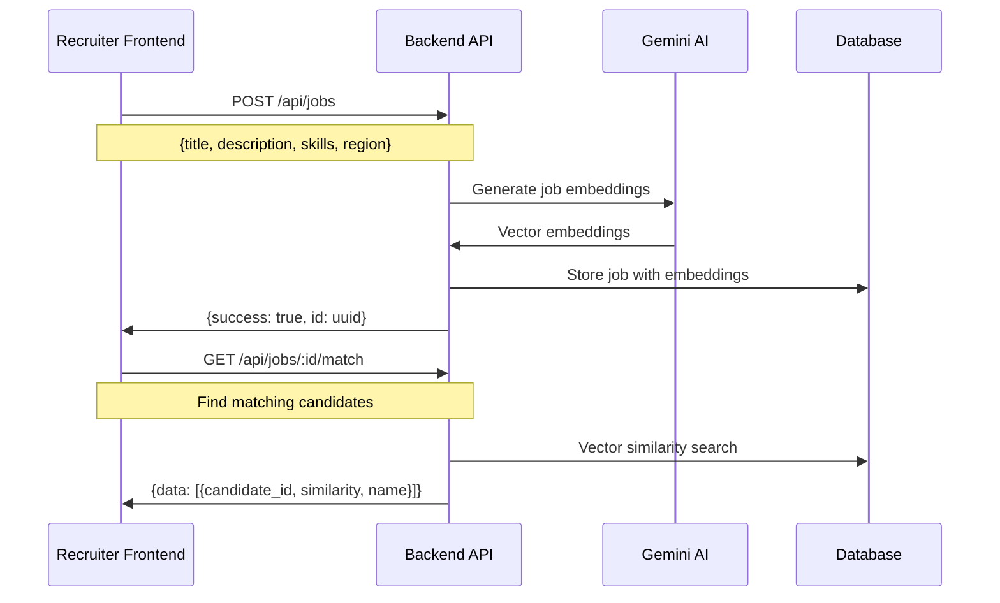

### 👥 **3. Candidate Management**

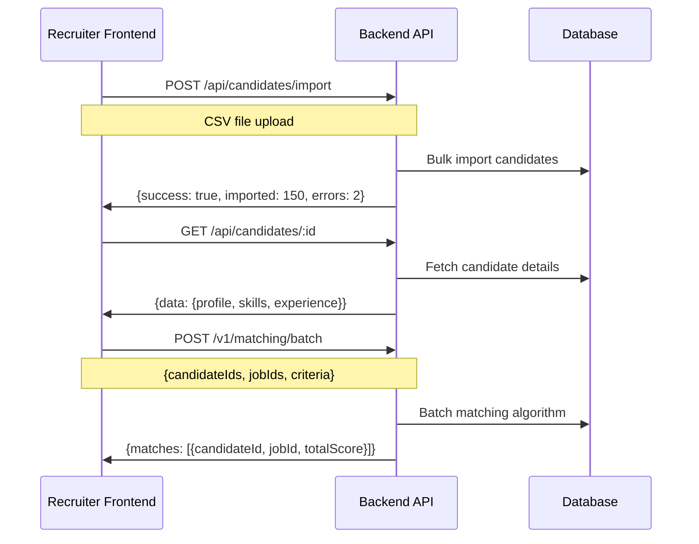

### 🎯 **4. Advanced Matching & Analytics**

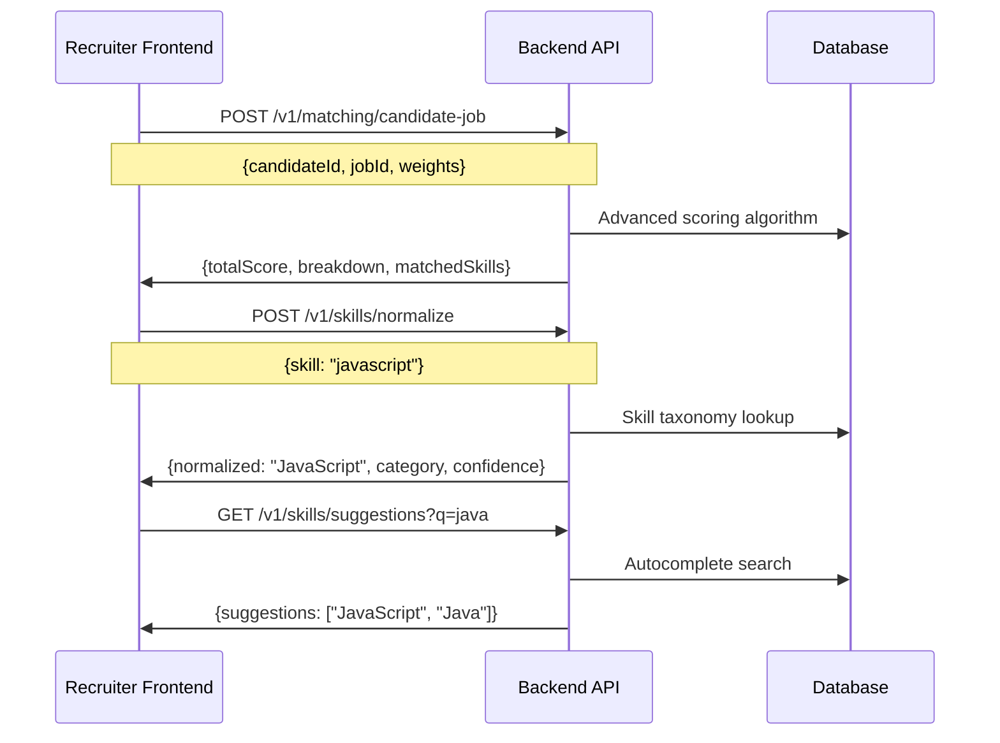

### 📊 **5. Monitoring & Administration**

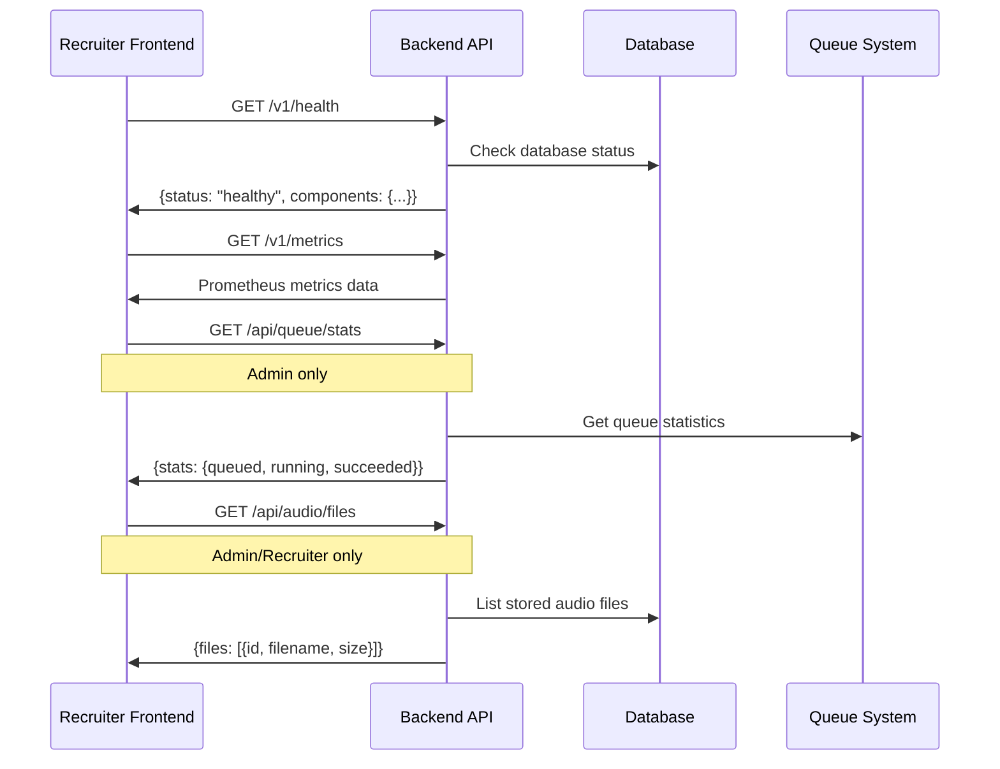

---

## 🔄 **REAL-TIME FEATURES**

### 🎙️ **Live Interview Streaming**

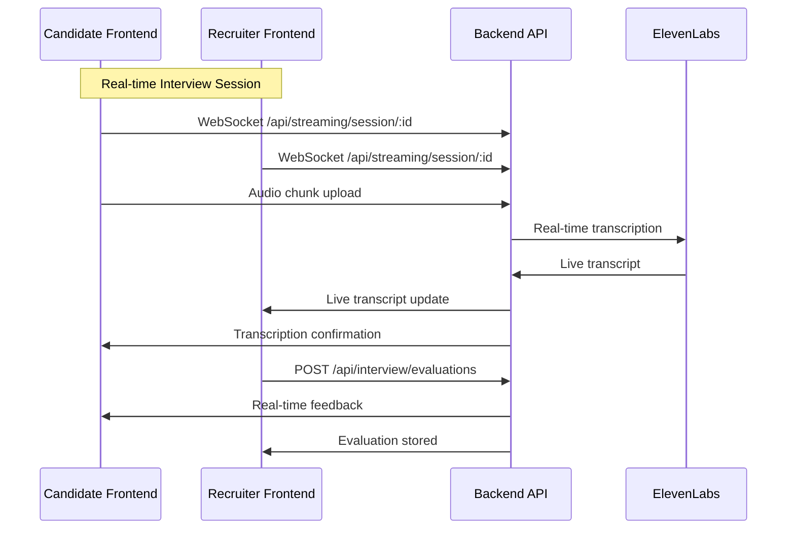

### 📡 **Server-Sent Events (SSE)**

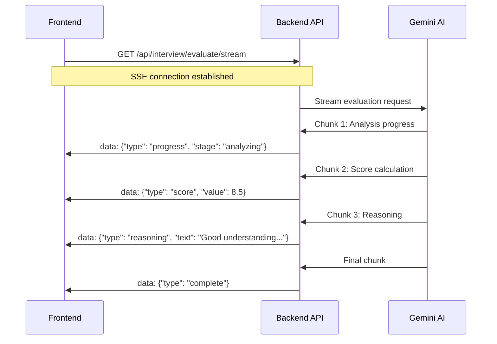

---

## 🎨 **FRONTEND ARCHITECTURE RECOMMENDATIONS**

### 📱 **Candidate App Structure**

```
candidate-app/
├── pages/
│   ├── auth/
│   │   ├── register.tsx
│   │   └── login.tsx
│   ├── dashboard/
│   │   ├── index.tsx
│   │   └── profile.tsx
│   ├── cv/
│   │   ├── upload.tsx
│   │   └── results.tsx
│   ├── interview/
│   │   ├── session.tsx
│   │   ├── questions.tsx
│   │   └── results.tsx
│   └── jobs/
│       ├── search.tsx
│       └── matches.tsx
├── components/
│   ├── AudioRecorder.tsx
│   ├── AudioPlayer.tsx
│   ├── SkillsDisplay.tsx
│   ├── MatchingScore.tsx
│   └── InterviewProgress.tsx
└── hooks/
    ├── useAuth.ts
    ├── useAudio.ts
    ├── useWebSocket.ts
    └── useInterview.ts
```

### 🏢 **Business Dashboard Structure**

```
business-app/
├── pages/
│   ├── auth/
│   ├── dashboard/
│   │   ├── index.tsx
│   │   └── analytics.tsx
│   ├── jobs/
│   │   ├── create.tsx
│   │   ├── list.tsx
│   │   └── [id]/candidates.tsx
│   ├── candidates/
│   │   ├── import.tsx
│   │   ├── search.tsx
│   │   └── [id]/profile.tsx
│   ├── matching/
│   │   ├── algorithm.tsx
│   │   └── results.tsx
│   └── admin/
│       ├── monitoring.tsx
│       └── queue.tsx
├── components/
│   ├── CandidateCard.tsx
│   ├── JobCard.tsx
│   ├── MatchingVisual.tsx
│   ├── AudioManager.tsx
│   └── AnalyticsDashboard.tsx
└── hooks/
    ├── useAdmin.ts
    ├── useMatching.ts
    ├── useCandidates.ts
    └── useJobs.ts
```

---

## 🔗 **KEY INTEGRATION POINTS**

### 🔐 **Authentication Flow**

- JWT tokens for session management
- Role-based access control (user/admin)
- API key authentication for admin features

### 📁 **File Handling**

- Multipart uploads for CV and audio files
- Real-time file processing with progress updates
- Secure file storage with signed URLs

### 🎵 **Audio Integration**

- ElevenLabs TTS for question narration
- ElevenLabs STT for answer transcription
- Real-time audio streaming with WebSockets

### 🧠 **AI Integration**

- Gemini AI for question generation
- Automated answer evaluation with scoring
- Skills normalization and matching

### 📊 **Real-time Features**

- WebSocket connections for live interviews
- Server-Sent Events for streaming evaluations
- Live transcription and feedback

This comprehensive workflow shows exactly how the frontend and backend will interact for both user types, providing a complete roadmap for building the ProofSkill platform! 🚀
